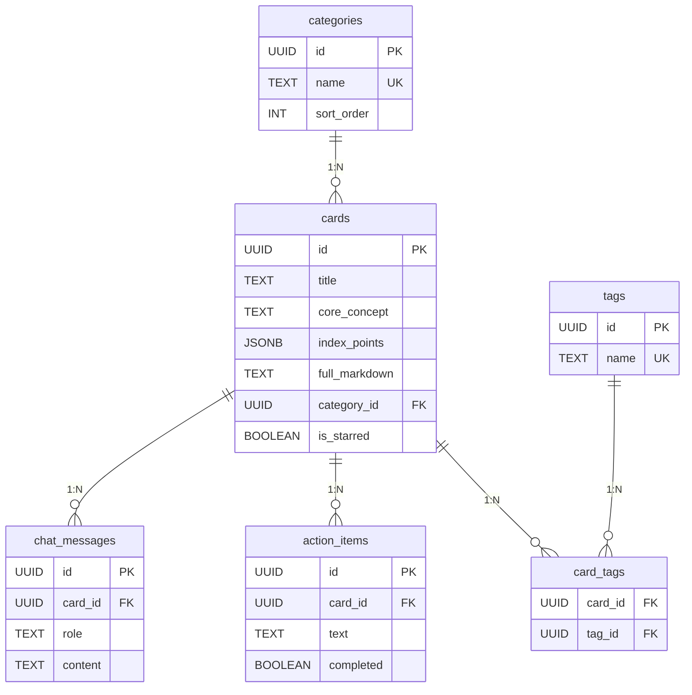

# Supabase 配置指南

## 一、创建 Supabase 项目

1. 访问 [https://supabase.com](https://supabase.com)，注册/登录账号
2. 点击 **New Project**
3. 填写：
   - **Project Name**: `ai-knowledge-synthesizer`（或你喜欢的名字）
   - **Database Password**: 设置一个强密码（后续不需要直接用，但请妥善保管）
   - **Region**: 选择离你最近的区域（推荐 `Southeast Asia (Singapore)` 或 `Northeast Asia (Tokyo)`）
4. 点击 **Create new project**，等待约 2 分钟初始化完成

## 二、获取连接凭证

项目创建完成后：

1. 进入项目 Dashboard → 左侧菜单 **Settings** → **API**
2. 复制以下两个值：

| 字段 | 位置 | 说明 |
|---|---|---|
| **Project URL** | `API Settings → URL` | 格式：`https://xxxxx.supabase.co` |
| **service_role key** | `API Settings → Project API keys → service_role` | ⚠️ **此密钥拥有完全权限，仅限后端使用，绝对不要暴露到前端** |

> [!CAUTION]
> `service_role` 密钥拥有绕过所有 RLS 策略的完全数据库访问权限。仅在后端服务器中使用，绝不能出现在客户端代码中。

## 三、执行建表脚本

1. 进入 Supabase Dashboard → 左侧菜单 **SQL Editor**
2. 点击 **New query**
3. 将 `server/db/schema.sql` 的完整内容粘贴进去：

```sql
-- 分类表
CREATE TABLE IF NOT EXISTS categories (
  id UUID PRIMARY KEY DEFAULT gen_random_uuid(),
  name TEXT NOT NULL UNIQUE,
  sort_order INT NOT NULL DEFAULT 0,
  created_at TIMESTAMPTZ NOT NULL DEFAULT now()
);

-- 知识卡片表
CREATE TABLE IF NOT EXISTS cards (
  id UUID PRIMARY KEY DEFAULT gen_random_uuid(),
  title TEXT NOT NULL,
  main_entity TEXT,
  content_type TEXT,
  core_concept TEXT NOT NULL,
  index_points JSONB NOT NULL DEFAULT '[]',
  full_markdown TEXT NOT NULL DEFAULT '',
  mindmap TEXT NOT NULL DEFAULT '',
  category_id UUID REFERENCES categories(id) ON DELETE SET NULL,
  source_url TEXT,
  source_type TEXT DEFAULT 'text',
  images JSONB NOT NULL DEFAULT '[]',
  is_starred BOOLEAN NOT NULL DEFAULT false,
  merged_count INT NOT NULL DEFAULT 1,
  source_card_ids JSONB NOT NULL DEFAULT '[]',
  original_source_cards JSONB NOT NULL DEFAULT '[]',
  x DOUBLE PRECISION,
  y DOUBLE PRECISION,
  created_at TIMESTAMPTZ NOT NULL DEFAULT now(),
  updated_at TIMESTAMPTZ NOT NULL DEFAULT now()
);

-- 标签表
CREATE TABLE IF NOT EXISTS tags (
  id UUID PRIMARY KEY DEFAULT gen_random_uuid(),
  name TEXT NOT NULL UNIQUE
);

-- 卡片-标签关联表
CREATE TABLE IF NOT EXISTS card_tags (
  card_id UUID NOT NULL REFERENCES cards(id) ON DELETE CASCADE,
  tag_id UUID NOT NULL REFERENCES tags(id) ON DELETE CASCADE,
  PRIMARY KEY (card_id, tag_id)
);

-- 行动项
CREATE TABLE IF NOT EXISTS action_items (
  id UUID PRIMARY KEY DEFAULT gen_random_uuid(),
  card_id UUID NOT NULL REFERENCES cards(id) ON DELETE CASCADE,
  text TEXT NOT NULL,
  completed BOOLEAN NOT NULL DEFAULT false,
  sort_order INT NOT NULL DEFAULT 0
);

-- 聊天记录
CREATE TABLE IF NOT EXISTS chat_messages (
  id UUID PRIMARY KEY DEFAULT gen_random_uuid(),
  card_id UUID REFERENCES cards(id) ON DELETE CASCADE,
  role TEXT NOT NULL CHECK (role IN ('user', 'assistant')),
  content TEXT NOT NULL,
  suggested_questions JSONB NOT NULL DEFAULT '[]',
  created_at TIMESTAMPTZ NOT NULL DEFAULT now()
);

-- 索引
CREATE INDEX IF NOT EXISTS idx_cards_category ON cards(category_id);
CREATE INDEX IF NOT EXISTS idx_cards_created_at ON cards(created_at DESC);
CREATE INDEX IF NOT EXISTS idx_cards_is_starred ON cards(is_starred);
CREATE INDEX IF NOT EXISTS idx_card_tags_card ON card_tags(card_id);
CREATE INDEX IF NOT EXISTS idx_card_tags_tag ON card_tags(tag_id);
CREATE INDEX IF NOT EXISTS idx_action_items_card ON action_items(card_id);
CREATE INDEX IF NOT EXISTS idx_chat_messages_card ON chat_messages(card_id);

-- 插入默认分类
INSERT INTO categories (name, sort_order) VALUES
  ('📚 知识库', 0),
  ('💼 工作', 1),
  ('🚀 个人成长', 2),
  ('🎨 生活', 3),
  ('📥 未分类', 4)
ON CONFLICT (name) DO NOTHING;
```

4. 点击 **Run** 执行
5. 确认输出 `Success. No rows returned` — 表示所有表创建成功

## 四、验证表结构

执行完成后，进入 **Table Editor**（左侧菜单），确认以下 6 张表已创建：

| 表名 | 说明 | 预期数据 |
|---|---|---|
| `categories` | 分类 | 5 条默认分类 |
| `cards` | 知识卡片 | 空 |
| `tags` | 标签 | 空 |
| `card_tags` | 卡片-标签关联 | 空 |
| `action_items` | 行动项 | 空 |
| `chat_messages` | 聊天记录 | 空 |

点击 `categories` 表，确认能看到 5 条预设分类数据。

## 五、配置本地环境变量

1. 在项目根目录复制 `.env.example` 为 `.env`：

```bash
cp .env.example .env
```

2. 编辑 `.env`，填入你的凭证：

```env
# Supabase
SUPABASE_URL="https://你的项目ID.supabase.co"
SUPABASE_SERVICE_KEY="eyJhbGciOiJIUzI1NiIs...你的service_role密钥"

# Gemini AI
GEMINI_API_KEY="你的Gemini API密钥"
```

## 六、安装依赖并启动

```bash
npm install
npm run dev
```

启动成功后终端会显示：

```
🚀 Server running on http://localhost:3000
📦 Supabase URL: ✅ configured
🤖 Gemini API:   ✅ configured
```

如果看到 ❌ 表示对应的环境变量未正确配置。

## 七、验证连接

打开浏览器访问 `http://localhost:3000/api/health`，应返回：

```json
{ "status": "ok", "timestamp": 1234567890 }
```

然后访问 `http://localhost:3000/api/v1/categories`，应返回 5 个默认分类的 JSON 数组。

## 数据库架构图



## 常见问题

### Q: 执行 SQL 报错 `relation "categories" already exists`
**A**: 脚本使用了 `CREATE TABLE IF NOT EXISTS`，不会报此错误。如果遇到，说明表已存在，可以安全忽略。

### Q: 前端加载数据为空
**A**: 检查 `.env` 中的 `SUPABASE_URL` 和 `SUPABASE_SERVICE_KEY` 是否正确。重启服务器后生效。

### Q: 如何迁移旧数据（localStorage → Supabase）
**A**: 应用首次加载时，如果 API 获取失败会自动回退读取 localStorage。未来可通过 `/api/v1/migrate/import` 端点批量导入。
